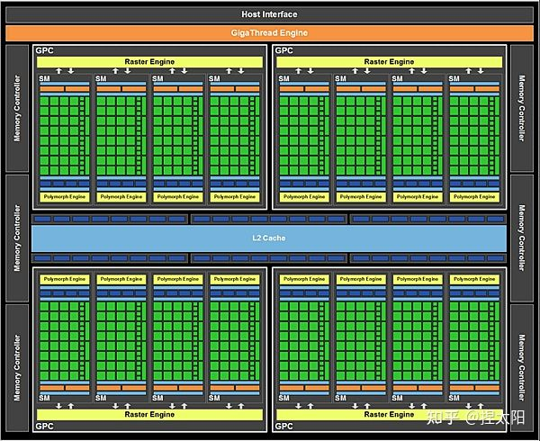

# GPU Architecture

哈佛架构下的计算机组成是由：CPU（包括算术逻辑单元，控制单元）、指令存储器、数据存储器以及输入输出设备够成的。

后来的冯诺依曼架构下，把指令也看成是数据的一部分，所以就把指令存储器和数据存储器合并了。

## CPU vs GPU

由于存储器发展慢于处理器，在CPU上发展出了多级高速缓存的结构，所以相比于GPU，CPU将很多的晶体管用于了缓存与流控（Flow Control），而GPU则将大多数的晶体管用于了计算。

从上图中可以看出GPU的计算核的数量要远远多于CPU，但Cache和Control却元少于CPU，这就导致了虽然擅长并行计算，但GPU支持的复杂指令或复杂指令的执行效率是远远低于CPU的，同时也将一部分并行编程的复杂性转嫁给了程序员。

从上面简单的示意图中，GPU的一个Control模块要对应多个Core，所以计算时，多个Core会同时执行相同的指令，这种计算模式也称为SIMT（Single Instruction Multiple Threads）。

这样的架构导致GPU适合的任务往往有2个特点：

1. **计算密集**：数值计算的比例要远大于内存操作，因为内存操作的延时可以被计算掩盖，从而对Cache的需求就没有那么大。
2. **数据并行**：大任务可以拆解为执行相同指令的小任务，计算模式相对简单直接，因此对于复杂流程控制需求较低。

## GPU的组成层次

从大的层次上看整个GPU是由以下几个部分组成：

* Processor Cluster，也就是GPC，它是由多个Stream Multiprocessor（SM）构成的。
* L2 Cache
* GigaThreadEngine （with MIG controll），这个在下图中没有体现出来，主要用于线程管理，分发线程块到SM上。
* Memory Controller
* GPU Memory (GDDR5/GDDR6/HBM2 RAM)
* Host Interface (PCIe x16 3.0/4.0)
* High Speed Hub，用于连接NVLINK等

## SM在各代GPU上进化

SM的组成可以参加下面的示意图：

**CUDA Core**：SM的核心的组成主要是很多的CUDA Core，每个CUDA Core中有一个整数算术逻辑运算单元（ALU: Integer Arithmetic Logic Unit）和一个浮点数计算单元（FPU: Floating point Unit）， 并且提供了对于单精度和双精度浮点数的FMA指令。

**LD/ST单元**：也就是Load/Store单元，支持多线程进行从Cache/DRAM中读取数据。

**SFU（Speical Function Unit）**：特殊函数计算单元，比用于计算sin/cos这类特殊指令。每个SFU每个时钟周期只能一个线程执行一条指令。而一个Warp(32线程)就需要执行8个时钟周期（4个SFU的前提下）。SFU的流水线是从Dispatch Unit解耦的，所以当SFU被占用时，Dispatch Unit会去使用其他的执行单元。

Wrap Scheduler：

Dispatch Unit：

Register File：

Shared Memory / L1 Cache：

### Fermi架构

### Kepler架构

### Maxwell架构

### Pascal 架构

### Volta架构

### Tuning架构

### Ampere架构

## 参考资料

* [英伟达GPU架构演进近十年，从费米到安培](https://zhuanlan.zhihu.com/p/413145211)
* https://zhuanlan.zhihu.com/p/394352476
* https://core.vmware.com/resource/exploring-gpu-architecture#section1
* https://face2ai.com/CUDA-F-1-0-%E5%B9%B6%E8%A1%8C%E8%AE%A1%E7%AE%97%E4%B8%8E%E8%AE%A1%E7%AE%97%E6%9C%BA%E6%9E%B6%E6%9E%84/
* https://www.zhihu.com/column/c_1351502583832354816

