# Udacity 344 Intro to Parallel Programming

本课程除了教你在GPU上进行并行计算外，重要的是介绍并行计算的思维

## Lesson 1 GPU Programming Model

### CPU vs. GPU 架构

如何让处理器处理的更有效率：
- 提高时钟频率，让单位时间的时钟周期会变得更多。
- 提高单条指令的能力，比如处理更多的数据，SIMD等。
- 同时有多个执行单元，多核。

时钟周期也称为振荡周期，定义为时钟频率的倒数。时钟周期是计算机中最基本的、最小的时间单位。在一个时钟周期内，CPU仅完成一个最基本的动作。一条指令的执行往往分为取址、译码、执行等多个步骤，需要多个时钟周期，而且执令的执行是流水线式的。

一味的提升时钟频率是不行的，因为需要增大电压，这样就会带来较大的功耗和较大的散热。这些年晶体管越来越小，已经达到了5nm以下，我们可以在同样尺寸上芯片上放更多的晶体管来达到更大的算力，但是为什么这些年CPU芯片的时钟频率没有怎么提高？首先是功耗，其次是散热。[为什么主流CPU的频率止步于4G?](https://zhuanlan.zhihu.com/p/30409360)

当我们拥有多个执行单元（多核）时，需要解决的是多核心的管理问题，让它们能很好的协作。

CPU架构上花了很多晶体管在电力与逻辑控制上，所以计算的效率并非最优的，GPU是有优势的。传统CPU优化的是单条指令的执行时间（latency，延时），而GPU优化的是吞吐量（throughput）。

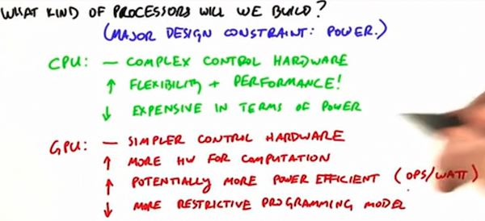

所以GPU的设计哲学是：1）大量轻量级的计算单元和简单的控制电路带来更多的计算能力；2）显式的并行编程模型；3）追求吞吐而不是追求延时。

### GPU编程

GPU像是一个CPU的协处理器，GPU是自己的存储，我们一般称为显存。

程序的执行是由CPU发起的，在整个程序运行过程中，可以通过CPU调用GPU的能力，比如驱动GPU申请一块显存、驱动GPU完成显存往内存上的拷贝、 驱动GPU执行一个kernel函数等。

GPU编程的经典步骤
- 用cudaMalloc申请显存
- 用cudaMemCpy把内存数据拷贝到显存上
- 执行Kernel函数，并行的对这些数据执行计算
- 将结果cudaMemCpy回内存上

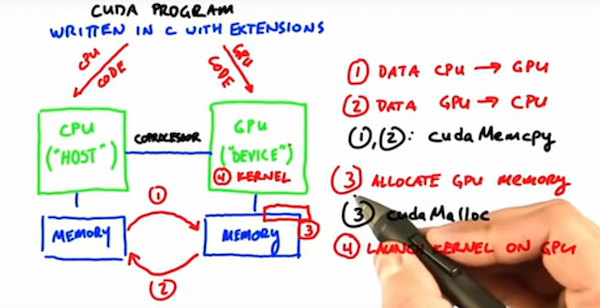

GPU上编程最核心的就是如何编程kernel函数，它的代码就像只在一个核上运行。GPU非常擅长做2件事情：1）同时启动大量的线程； 2）同时运行多个线程 。

kernel函数调用的写法`kernel_function<<<dim3(bx,by,bz), dim3(tx,ty,tz), shmem>>>(args...)`。其中dim3是一个数据结构，有`x`、`y`、`z` 3个成员。隐藏转换`num`为`dim3(num, 0, 0)`。

`threadIdx`用于在kernel函数中获取当前线程在`block`中的定位，`blockIdx`用于获取当前`block`在`grid`中的定位。在kernel函数中通过`blockDim`来获取一个`block`的维度，通过`gridDim`来获取`grid`的维度。在一维情况下，一个线程的id计算公式为：`blockIdx.x * blockDim.x + threadIdx.x`。

每个GPU都有一些编程限制，可以通过`deviceQuery`程序来查看：

```txt
Total amount of global memory:                 6075 MBytes (6370295808 bytes)
(10) Multiprocessors, (128) CUDA Cores/MP:     1280 CUDA Cores
GPU Max Clock rate:                            1709 MHz (1.71 GHz)
Memory Clock rate:                             4004 Mhz
Memory Bus Width:                              192-bit
L2 Cache Size:                                 1572864 bytes
Total amount of constant memory:               65536 bytes
Total amount of shared memory per block:       49152 bytes
Total number of registers available per block: 65536
Warp size:                                     32
Maximum number of threads per multiprocessor:  2048
Maximum number of threads per block:           1024
Max dimension size of a thread block (x,y,z): (1024, 1024, 64)
Max dimension size of a grid size    (x,y,z): (2147483647, 65535, 65535)
Maximum memory pitch:                          2147483647 byte
```

如上图所示，每个block中最大有1024个线程，而每个sm中最大有2048个线程，所以每个sm最大同时执行2个block（线程为1024的Block）。在我1060的卡上测试，如果blockDim设置为(1024, 2, 1)，使用`cudaGetLastError`获取错误返回为：`invalid configuration argument`。

##  Lesson 2 GPU Hardware and Parallel Communication Pattern

### 并行计算中的通信模式

在并行计算中，有大量的计算核心，这些计算核心操作的数据往往都在全局存储上，所以核心问题就是如何管理这些计算核心（线程）让他们能够很好的一起工作，由于涉及到共享全局存储的问题，所以一起会有一些

**Map**: 每个对应的输出位置，访问其一一对应的输入位置，我们可以把Map模式表示为：

```
map(elements, function)
```

它将function作用在每一个element上，GPU对这种计算模式具有很常好的支持。

每个输出位置，都会访问多个的输入位置，线程Idx是在输出序列上的。

**Scatter**：每个输入位置，都会对应被一个或多个输出位置读取，线程Idx是在输入序列上的。

**Stencil**：每个输出位置，都访问输入中一个模板对应的位置

**Transpose**：输入输出一一对应，但在2维结构上，是转置的，或者由AoS转为SoA。

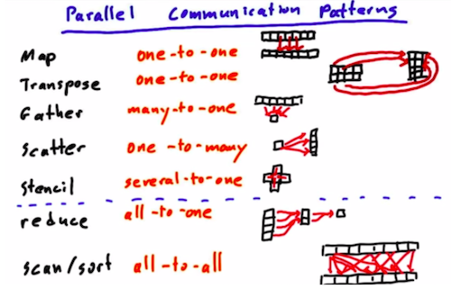

这里gather和stencil也没有特别明显的区分。

### GPU架构

**CUDA编程模型**：

* 我们通过kernel函数启动的大量GPU线程，是按块，划分为多组的。其中一个block里的所有线程，会调度到同一个流处理器（SM）上执行，每个SM上都有一个shared_memory，可以被这一组线程共享访问。

* 多个block被调度到不同的SM上，顺序是不能保证，执行时间也没有保证。

* 不同的kenrel函数之间执行是串行的，只当前的kenrel函数中的所有block都执行完后，下一个kernel函数才会执行。

这样的编程模型让我们程序可以适配在不同处理能力（不同数量的SM）的GPU设备上。

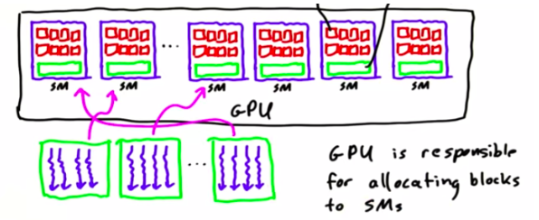

GPU的内存层次：每个线程都有自己的local memory，每个SM有shard memory，可以被一个block中的多个线程共享访问；所有SM中的线程都可以访问global memory。

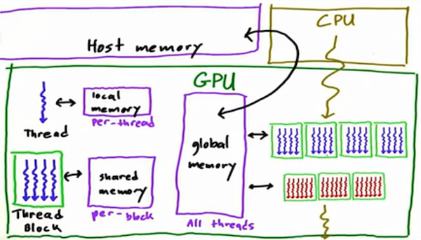

同一个block中的线程经常需要共享操作shared_memory，比如先写再读，那就需要等所有线程都写完后，所有线程才能开始读。这时就需要所有线程同步，`__syncthreads()`就是一种`barrier`措施，在插入了`__syncthreads()`的地方，同一个block中的所有线程执行到这里时，都需要等待，当前所线程都到达时，才再次开始同时执行。

对于shared memory的使用，一般都是先写入，后用；可以用在那些一次载入，多次使用的数据上。如果访问模式中有错位（对应线程序号，访问了非对应位置的shared memory)，那都需要在读取后，设置`barrier`，然后读取。比如：

```c
__shared__ int arr[128];
// arr[i] = arr[i + 1];
temp = arr[i + 1];
__synthreads();
arr[i] = temp;
```

### 编写高性CUDA程序

编程高性能CUDA程序，最核心的就是要最大化计算密度，计算密度 = 计算 / 访存，CUDA程序优化的核心往往都是优化访存的时间。对于一些需要反复从global memory中读取的数据，尽量先加载到sharedMemory中或local memory中进行处理。

对于Gobal Memory的访问，特别要注意，连续访问的性能，比按Stride的性能高，更比随机访问的性能要高。（这里应该是因为有L2 Cache的原因），所以这里我的优化策略是：合并内存访问。

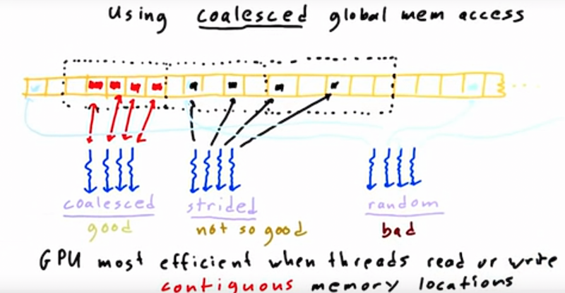

多线程访问同一个global memory资源时，需要加锁； 或使用原子函数：`atomicAdd`等。

除了要注意提高计算密度的问题，编写高性能CUDA程序额外需要注意的是避免线程发散：不同的线程，走了不同的if-else分支，或循环次数不同。

## Lesson 3 Fundamental GPU Algorithms: Reduce、SCAN、Histogram

本节课主要学习2方面的内容：1）如何评估GPU算法的速度与效率；2）3个基础的GPU算法：Reduce、SCAN和Histogram。

### 并行算法的评估

在并行算法中，我们除了关注任务完成的时间外，我们还会关注总的工作量，因为任务是由多个核一起完成的，在单核情况下，任务完成的时间就是总的工作量，而在多核心情况下，每个核心花费的时间总和才是任务的工作量。

我们把完成某一特定计算任务需要的时间称为Step，而把所有参加到这个计算任务的worker的时间总和称为总工作量（work）。所以后续我们可以使用**step complexity**和**work complexity**两个指标来衡量1个并行算法的复杂度。

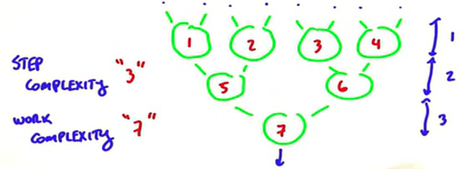

我们用work-efficent来评估并行算法与串行算法，如果并行算法和串行算法有着差不多的work complexity，但step complexity更小，那么这个并行算法一般都是有效的。

### Reduce

Reduce算法的定义：
- Set of Elements
- Reduce Operator: 1）2元运算符； 2）具有结合性 (a op b) op c  = a op (b op c)

串行Reduce的计算非常的简单，直需要对Elements进行遍历，然后一直对结果和Element执行二元运算就可以了。

```
result = 0
for item in elements:
	result = op(result, item)
```

可以看出串行代码的Step Complexity和Work Complexity都为为$O(n)$。

并行版本的Reduce，就是把整个计算看成一个二叉树状，从叶子开始一层一层的计算，它的step complexity为$O(\log n)$，而work complexity依然为$O(n)$。并行算法在步骤复杂度上非常有优势，但如果想取得这么大优势的加速提升，需要有足够多的计算单元，比如对于100万个数进行加法，那第一层的运算需要50万个计算单元，而实际一般的GPU也只有几千的计算单元。

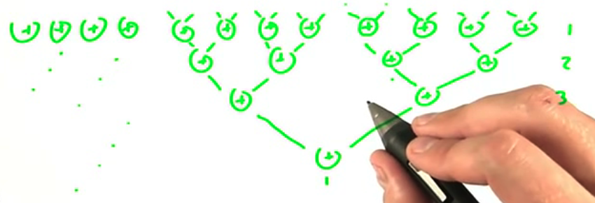

CUDA版本的Reduce的实现，假设我们要对100万（1<<20）个数字进行Reduce，那么我们整个Reduce是分为2步的，第一步是同时执行1024个线程块，每个线程块有1024个线程，对1024个数字进行并行Reduce，每个线程块产生一个结果，最终1024个线程块的结果，再用一个线程块来进行Reduce。

```cpp
// d_out的长度等于线程块的个数，每个线程块把reduce的结果写到d_out[blockIdx.x]
__global__ void global_reduce_kernel(float *d_out, float *d_in) {
	int myId = threadIdx.x + blockDim.x * blockIdx.x;
  int tid = threadIdx.x;
  // 每次迭代都将序列一分为二，右边的数字加到左边上
  for (unsigned int s = blockDim.x / 2; s > 0; s = s / 2) {
  	if (tid < s) {
    	d_in[myId] += d_in[myId + s];
    }
    __syncthreads();
  }
  if (tid == 0 ) {
  	d_out[blockIdx.x] = d_in[myId];
  }
}
```

上面的代码中在for循环内，需要对d_in进行反复的读取，所以我们可以使用共享内存进行优化。

```cpp
__global__ void shmem_reduce_kernel(float *d_out, float *d_in) {
	int myId = threadIdx.x + blockDim.x * blockIdx.x;
  int tid = threadIdx.x;
  
  extern __shared__ float sdata[]; // 声明shared memory
  // 将数据从global memory拷贝到shared memory
  sdata[myId] = d_in[myId];
  __syncthreads();

  for (unsigned int s = blockDim.x / 2; s > 0; s = s / 2) {
  	if (tid < s) {
    	sdata[tid] += sdata[tid + s];
    }
    __syncthreads();
  }
  if (tid == 0 ) {
  	d_out[blockIdx.x] = sdata[tid];
  }
}
```

可以手动计算一下，shared memory版本将会减少一半我们对global memory的访问。

### SCAN

#### SCAN算法的基本介绍与串行实现

SCAN是一个看起来在串行编程中没什么用的计算模式，但在并行计算中却非常有用，它可以帮助我们把大量看起来无法并行化的计算并行化实现，比如在内存压缩与分配，快排、稀疏矩阵计算等应用中。

SCAN算法的定义
- Set of Elements
- Reduce Operator: 1）2元运算法； 2）具有结合性 (a op b) op c  = a op (b op c)
- 存在单位元I，满足 a op I = a

SCAN的输出结果是和输入序列等长的一个序列，输出序列每个位置上的值为输入序列该位置之前的所有元素Reduce的结果。


SCAN算法的串行计算代码为下：

```cpp
int acc = identity;
for (int i = 0; i < elements.size(); i++) {
	acc = acc op elements[i];
  out[i] = acc;
}
```

所以整个算法的step complexity和work complexity都为$O(n)$。

在讨论并行SCAN如何实现之前，我们先从宏观视角来看为什么SCAN很有用，在并行计算中，我们常常遇到如下的计算模式，有一个输入序列，我们要计算一个输出序列，而输出序列中的每一项都依赖第一项的结果，导致整个计算过程看起来是一个前向依赖，串行化的模式。**类似这种的计算问题，大部分我们可以通过SCAN来解决**。

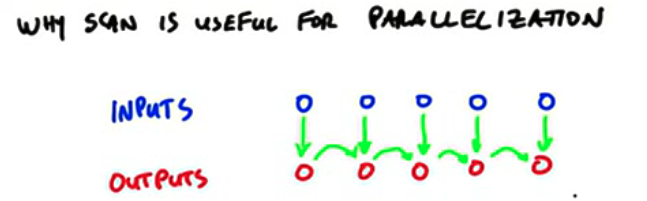


SCAN算法包括2种形式：1）Inclusive； 2）Exclusive

对于输入序列[13, 7, 16, 21, 8, 20, 13, 12]

如果我们执行Inclusive SUM SCAN，则表示对应位置的输出是包括输入对应位置之前的元素**以及对应位置**的元素，它的结果为

[13, 20, 36, 57, 65, 85, 98, 110]

如果我们执行Inclusive SUM SCAN，则表示对应位置的输出是包括输入对应位置之前的元**素但不包括对应位置**的元素，它的结果为

[0, 13, 20, 36, 57, 65, 85, 98]

这两种SCAN的形式，可能在一些并行问题中都会被用到。它们之间的转换其实也非常简单（中间都是一样的，只有首尾错位了一些）。

对于SCAN来说，一种直观的并行实算法是，每个对应输出位置，都是一次Reduce计算。这样每个输出位置就不再依赖前一个输出位置的结果了。

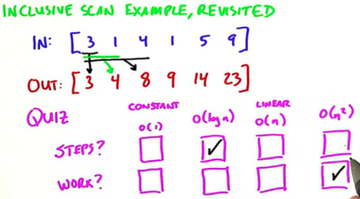

但上面的算法的work complexity太高了，而且每个线程执行的计算极不平衡。

#### Hillis Steele SCAN算法

算法的发明人是Danny Hillis和Guy Steele，于1986年发明。

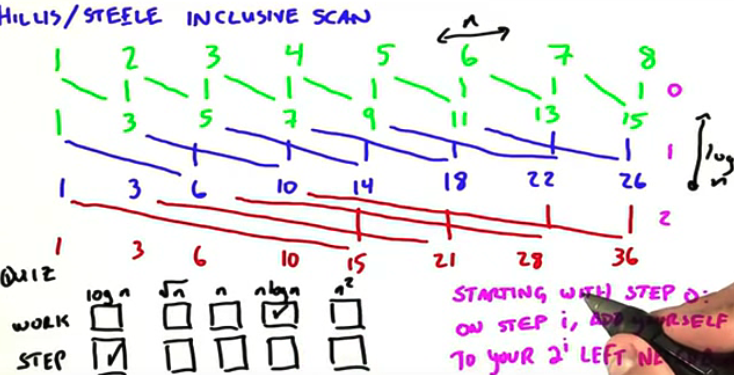

每轮计算，步长s按1,2,4,8,... 这样2的幂次方增长，每个元素都加上自己左边离自己s步长的元素，如果它超出了数组，则原地复制自己。长度大于数组长度为止。

```c++
void HillisSteeleScan(float *in, float *out, int n){
	for(s = 1; s < n; s = s * 2) {
    for (int i = 0; i < n; i++) {
      if (i - s >= 0) {
        out[i] = in[i] + in[i - s];
      } else {
        out[i] = in[i];
      }
    }
    // 在串行算法中，实际上可以直接执行原地操作
    for (int i = 0; i < n; i++) {
      in[i] = out[i];
    }
	}
}
```

HillisSteeleScan的并行算法实际非常高效，它也是在GPU上实现的第一种扫描算法。

#### Blelloch SCAN算法

Guy Blelloch在1990年宣传了另外一种扫描公式。它拥用更好的work complexity：$O(n)$​，但它比HillisSteele算法的Step Complexity高一倍。它是一种Exclusive SCAN算法。

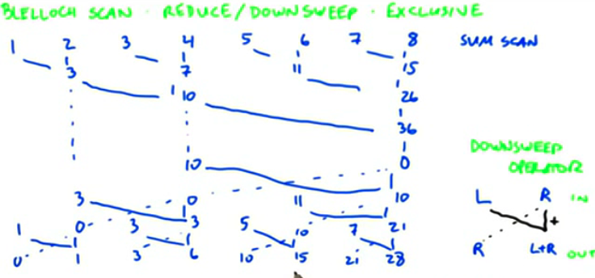

算法上整体分为2个阶段：

第一个阶段进行向下Reduce，按一定的步长s遍历数组中的元素，将其左边距离步长s的元素和自己相加。需要注意的是这个阶段的迭代中有一些中间结果，这些中间结果需要缓存下来。

第二个阶段相反，步长从大到小，每个元素和其左边步长为s的元素执行一种新的DownSweep的操作。

#### 哪种算法更快

不同的机器和不同的输入数据，结果可能都不一样。

当我们有大量的处理器，但整体的计算量不大时，我们倾向于选择Step Complexity更佳的。但我们任务的计算量远大于处理器数量时，则优先选则work complexity更佳的。

有一些复杂，并行计算任务，在多个步骤中，每步的step complexity和，work complexity会变化，所以我们可以灵活的来选择不同的算法策略。


### Histogram算法

直方图算法是将一个序列按一定的分组区间进行统计。我们可以使用串行代码表示如下：

```c
// 先将每个区间的统计值设置为0
for (int i = 0; i < bin.count; i++){
	hist[i] = 0;
}
// 再遍历序列，对序列中的每个元素，调用computeBin来计算所属于的区间
for (int i = 0; i < mesurements.size(); i++){
	hist[computeBin(mesurements[i])]++;
}
```

对于长度为n的序列，如果我们划分的区间个数是b，则每个区间最大可能的统计值为n，意味着所有的元素都落在了同一个区间上；平均每个区间上的元素个数是n / b。

对于并行化的Histogram算法，最直接的就是把上面串行代码中第二个for循环，改为多个线程同时执行。但多个线程由于对于hist是共享访问和修改的，所以这里会存在数据竞争的问题。

无论是GPU显存还是CPU内存，我们的类似运算指令对于内存上值的修改都会包括3个部分：

1. 将内存中的值从内存读到寄存器中
2. 在寄存器中完成运算
3. 将寄存器中的运算结果写入到内存中。

上面这3个步骤RMW（Read+Modify+Write）并不是原子的。

下面是使用原子操作的并行算法的版本：

```c++
__global__ void simple_histo(int *d_bins, const int *d_in, const int BIN_COUNT)
{
  int myId  = theadIdx.x + blockDim.x * blockIdx.x;
  int myItem = d_in[myId];
  int myBin = myItem % BIN_COUNT;
  atomicAdd(&(d_bins[myBin], 1);
}
```

上面实现的问题在于原子操作的互斥性，容易导致大量的线程都补卡在了原子语句的执行前。尤其是当我们的线程越多，划分的区域越少时，则冲突越严重。

另外一种实现是：我们使用K个线程，每个线程处理N/K个元素，来求取一个局部的直方图，最后再把每个线程的真方图加在一起。这样在每个线程里由于是串行处理，所以不需要使用原子操作。

最后一种算法是使用排序，将每个元素属于的区域的index作为key，value为1，这样就形成了一个pair的序列，我们对这样的序列进行sortByKey，然后再ReduceByKey，就可以得到直方图统计了。

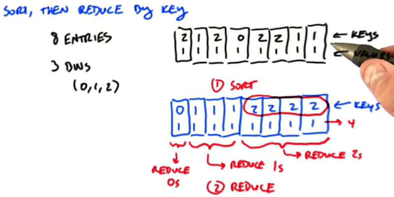

## Lesson 4 Fundamental GPU Algorithm: Application of Scan and Sort

这节课主要学习的内容是SCAN并行原语的一些应用，以及排序。

### Compression

Compression就是对一个大的输入集合，过滤掉一些不在意的项后，把剩余的项重新组织在一起。我们也经常把这个过程称为过滤。

为什么Compression在并行计算中如此重要呢？

如果对一个集合进行并行计算时，每个线程处理一个元素，如果某些元素不满足或触发计算步骤，那么就容易出现线程发散，尤其是当计算比较重的时候。所以常见做法先通过一个过滤压缩把满足计算条件的元素搜集在一起（连续存储），再执行并行计算。集合越大，压缩的优势越大；计算越重，压缩的优势越大。

使用SCAN将稀疏的元素压缩到一起：

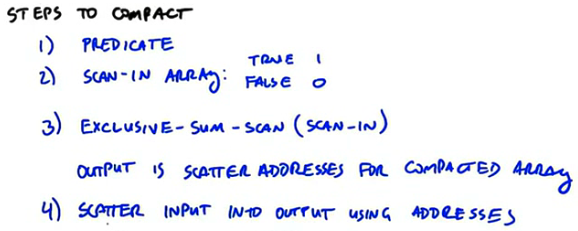

更为一般的，我们称之为动态分配，意思是对于输入集合中的每个元素，它对应产生的输出可能会占用不定长的存储空间。那么我们该如何并行的分配存储和拷贝呢？

1. 先计算每个输入对应的输出需要的存储空间的大小
2. 执行SUM Reduce，来计算输出总共需要的存储空间的大小
3. 执行SCAN来计算每个对应输出的元素在存储空间中的地址位置
4. 执行拷贝

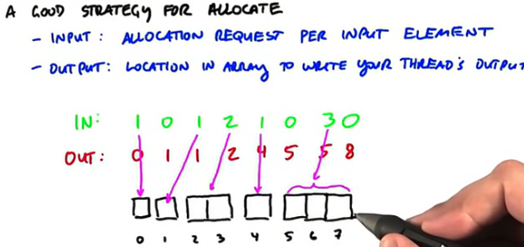

分段SCAN：有时候我们会发现我们需要对很多份小的序列进行SCAN，如果我们串行的一个一个的执行SCAN，效率就会比较低。我们可以选择将这些序列拼在一起，然后进行分段SCAN。

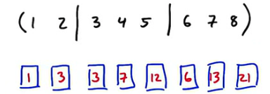

### 稀疏矩阵与向量乘法

我们使用三个数组来表示稀疏数组，以下是CSR（Compressed Sparse Row）表达形式：

* VALUE：逐行记录矩阵中的非零元素

* COLUMN：记录非零元素所属于的列号

* ROWPTR：记录每一行的第一个非零元素在VALUE数组中的位置

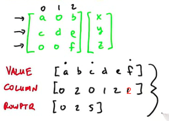

在计算矩阵与向量乘法的时候，我们可以把[x,y,z]使用COLUMN来构造一个和VALUE数组等长的数组，执行点乘，最后再执行分段SCAN。

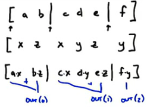

### ODD-EVEN Sort（BRICK SORT）

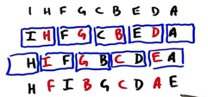

ODD-EVEN SORT算法每次迭代都会按奇偶组合2个相邻的元素，然后按大小进行比较和交换位置 。该算法的实现非常容易，而且非常易于并行，可以把GPU跑得很满，然而它的Step Complexity为$O(n)$，Work Complexity为$O(n^2)$。所以为它并不是一个很好的并行算法。

### MergeSort

归并排序是将两个已经排序好的序列合并排序在一起。在GPU中，我们可以将整个序列切分为很多份，然后利用多核并发的进行归并排序，进而进行逐层的归并排序。

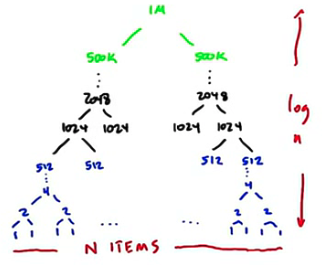

这个算法的挑战之处在于，在整个逐层归并过程中，归并的线程数和每个线程里要归并排序的元素个数变化很快。

在最底层蓝色的阶段：这时候有大量归并线程，每个线程只处理很小的数据，我们往往在线程内串行的进行每个数据的排序。

在中间的黑色阶段：往往每个线程块负责一路归并任务。

在绿色的阶段：只有很少的归并任务，这时候如果我们仍然是一个线程块负责一个归并任务的话，会有很多SM闲置，所以我们需要使用不同的归并算法。

归并算法从逻辑上看是串行的：


下面来看并行化的归并算法是如何运行的，对于两个排序好的序列，我们本质上是为每个序列中的每个元素，在输出序列中找到一个正确的位置，这有点像是compact里的scatter过程。

每个线程来负责找到一个元素的输出位置，它的输出位置是由它在本序列中的位置+其他序列中的位置得到的，在本序列中的位置可以直接由threadIdx.x计算出来，而在其他序列中的位置，则需要执行一个二分搜索。但这个二分搜索可以在SharedMemory中执行（也就是说把另一个序列加载到SharedMemory中）。

最后要看了就是绝色部分的，二个很大的有序集合如何归并了：

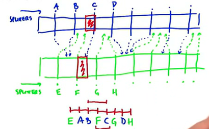

1. 我们分别在2个序列中选择一些分割点
2. 将这些分割点序列进行归并排序
3. 根据排序后的分割点，将2个序列分成多段：EA，AB，BF，FC等。
4. EA这一段有哪些元素，需要A在EF中进行二分查询。
5. 然后再对每一段进行并行的排序。

### Bitonic Sort

Bitonic Sort是一种Sorting Networks（排序网络），它是OBLIVIOUS的，意思是它的整个算法运算的路径和数据本身没有关系，无论在什么样的数据分布上，执行的步骤都是一样的。

OBILIVIOUS特性比较适配在GPU上运行，因为GPU本身在运算控制方面是比较弱的。

**双调序列**是一个先单调递增后单调递减，或者先单调递减再单调递增的序列。

**Batcher定理**：将任意一个长度为2n的双调序列A分为等长的两半X和Y，将X中的元素和Y中的元素一一按原序比较，即A[i]和A[i+n]比较，将较大的放入MAX序列，较小的放入MIN序列。那么得到的MIN和MAX序列仍然是双调序列，并且MAX序列中任意一个元素都不小于MIN序列中的任意一个元素。

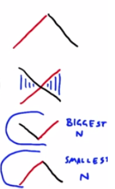

双调排序：有了Batcher定理后，我们只需要对一个双调序列进行递归一拆分二，然后进行Batcher划分，那么最终就会得到一个排序好的序列。如下图所示：

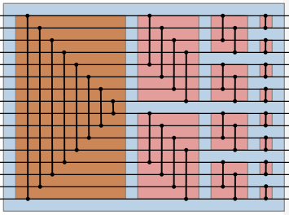

那么我们如何把任意一个序列变成双调序列呢？

把一个升序和一个降序排列的序列组合在一起就构成了一个双调序列，然后这个双调序列可以再经过双调排序变成升序或降序的序列和另一个序列组合在一起形成新的更长的双调序列。

我们从2个元素开始，逐步组合小序列，形成大序列，就可以最终形成一个大的双调序列了。

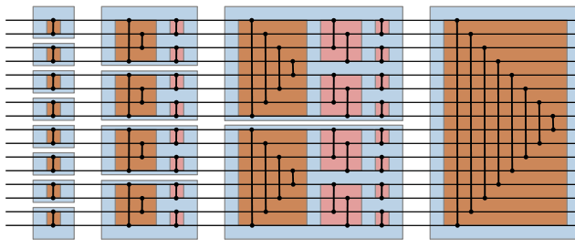

### Radix Sort

基数排序是指将数字序列根据其二进制位来进行排序，整个算法也非常简单，步骤描述如下：

1. 从数字的最低位开始
2. 根据低位上的比特位是0或1，将整个序列分为2个部分，0的在前，1的在后。
3. 然后从次低位开始，循环上面的步骤。

算法需要注意的是，每次调整元素的顺序时，低位相同的数字要保持原有的顺序。我们可以使用2次Compact来进行序列的划分。

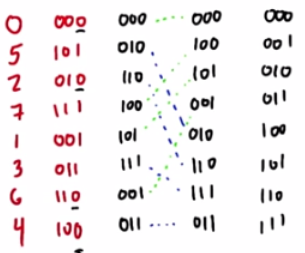

整个算法的Work Complexity为$O(kn)$，其中k是数字的位数。Step Complexity为$O(k)$。

## Lesson 5 Optimizing GPU Programs

- 高效GPU程序的几个原则
  - 增大程序的计算密度
  - 减小程序的存储操作密度
  - 合并全局内存访问 
  - 避免线程发散
  - 利用好存储的层次结构
- 优化的层次，一般注重前3条就行了，在GPU下，后2条，尤其是最后一条的收益不大
  - 选择好的算法
  - 遵守GPU编程的基本原则（上面那几条）
  - 与架构相关的详细优化
  - 指令级别的微优化
- APOD流程
  - Analyze: 部析程序的热点部分，是不是可以并行化加速
  - Parallelize：使用AVX、OpenACC、OpenMP、CUDA等来加速
  - Optimize
  - Deploy：在真实的数据与环境上运行，看效果
- 矩阵转置的GPU实现
  - 直接GPU加速会，导致DRAM的带宽使用率低，因为会出来大Stride写入的问题
  - 每次Load一块，在shared memory中进行转置，再拷贝回去
  - 使用shard memory就会遇到 __syncthreads的问题，这时候，需要适当降低线程块中线程的数量
- 优化所有线程在`barrier`前面的等待时间
- 避免同一个`wrap`中所有线程的线程发散（有不同的执行分支），因为所有wrap中的线程是同步执行的，如果有分支，那当有一部线程在执行某个分支时，其他线程在等待。
- 使用一些内置的数学函数：`__sin`、`__cos`、`__exp()`等
- 使用`pinned memory`
- 使用MultiStream和异步拷贝。不同stream上内存操作与核函数执行都是可以异步的，同一个stream上的拷贝与核函数执行是排队的。

## Lesson 6 Parallel Computing Patterns

对于GPU编程来说，最大的挑战在于，对之前从来没有见过的问题或求解模式进行并行化。所以本节的主要内容，就是看一些有趣的问题，如何被并行化的。

### Dense N-Body

这个问题的背景与解决方法，可以参考NVIDIA的官方博客：[chapter-31-fast-n-body-simulation-cuda](https://developer.nvidia.com/gpugems/gpugems3/part-v-physics-simulation/chapter-31-fast-n-body-simulation-cuda)

All Pair N-Body是N-body中最简单的模式，也被称为蛮力方法，包括分开计算每对元素之间的力，然后对每个元素上产生的力进行加和。它的算法复杂度是$O(n^2)$。

对于Nbody问题，有很多可以加速的方法，用于近似计算，比如基于树的方法，有种算法叫Barnes Hut，它的算法复杂度是$O(n\log(n))$。

快速多极（Multi-pole）算法可以用于高精度的快速近似计算，复杂度为$O(n)$：它的本质是把遥远的物体混为一体，在计算过程中把它们视为一个单一的整体。快速多极算法实际上被评为20世纪10大算法之一。

multipole算法：[论文](https://aip.scitation.org/doi/pdf/10.1063/1.4773727)，[实现](https://github.com/duanebyer/nbody)

我们这里将通过演示All pair Nbody的计算问题来演示，如何有效地使用内存层次结构来加速我们的计算过程。

朴素来实现的话，我们都使用global memory，那么在我们计算$N\times N$的Nbody的关系矩阵时，每个元素都需要被我们反复多次的读入内存，如果我们是使用$N^2$的线程，每个线程计算一对pair之间的力，那每个元素会被从global memory中加载2N次，分别是该序列在$N\times N$矩阵中对应的那一行和那一列。

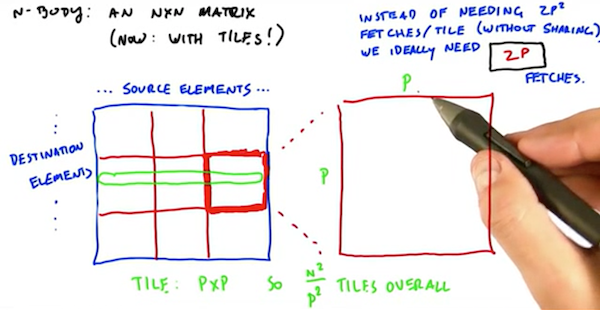

将整个矩阵划分为网格，每个网格我们称之为一个Tile，它的大小是$p\times p$，正常情况下，我们要计算这个网络内的矩阵值的话，我们需要把这个网格涉及到的元素从global memory加载，每个元素都要被加载$2p$次。

我们的优化目标是，对于一个Tile中需要加载的元素，我们只加载1次。

如果我们使用的方式是对于这个Tile中的$p^2$个点，使用$p^2$个线程，那会存在很多的问题：1）这些线程之间需要通过sharedMemory来共享数据；2）当我们进行力的横向加和时，需要考虑线程之间的同步问题。

另外一种方式是是只使用$p$个线程，每个线程在横向上计算，使用一个`for`循环。


这种模式下，只需要将sourceParams加载为sharedMemory中，而dstParams不需要共享了。也不需要在不同线程间来汇总单独的力。


这种模式降低了整个程序的并行度，但当我们解决的Nbody问题的N很大的时候，我们对线程的使用率是很高的，这种模式也能达到很高的计算吞吐。

选择多大的网格$p$，如果网格太大，会导致我们要加载进sharedMomory中的sourceParms较大，有可能sharedMemory放不下。同时如果网格太大，将会导致线程块较少，可能用不完所有的SM。

如果网格太小，那么对于global memory的访问压力就会比较大。


 这个例子说明了，在一些问题上，适当让每个线程做更多的事，减少并发程度，可能会取得更好的效果。

### 稀疏向量乘法实现优化SpMV

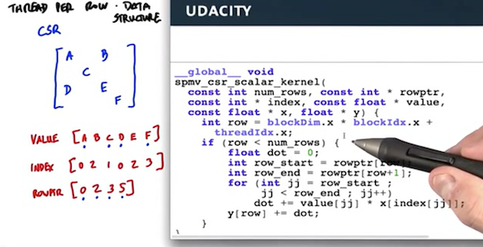

上面的代码计算的是$y += Mx$，其中$M$是稀疏矩阵，$x$和$y$都是列向量。

在cuda代码中，每个线程计算y的一行的结果。

由于M中每行的长度可能不一样，导致了一个线程束（wrapper）的执行时间，取决于运行最慢的那个线程。

这种情况下我们可以采用，每个线程只计算2个数乘法，然后用bacward inclusive SCAN SUM来计算每一行乘积的加和。这种算法对于每一行长度的变化就不敏感了。但这种算法需要线程间通信了。

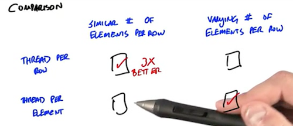

针对这个问题，比较学术的讨论可以参考：[Efficient Sparse Matrix-Vector Multiplication on CUDA](http://wnbell.com/blog/2008/12/01/efficient-sparse-matrix-vector-multiplication-on-cuda/)


这个例子说明了2个优化思路：

* 需要让线程尽可能的busy，一个wapper里的线程不能太发散
* 管理通信开销同样重要

### 图的广度优先搜索

对于一个图来说，如果每个顶点相连接的边很多，则这个图是一个稠密的图，相反，如果边很少，则是一个稀疏的图。

现实中的很多问题都可以用图模型来建模，比如整个Web可以看成一个超大的图，页面就是顶点，而页面之间的超连接关系构成了边；人的社交关系就是一个很大的图，顶点就是每个人，边则是两个人认识，互为好友关系。

对于图结构，最广泛的操作就是对图中所有的结点的遍历，比如对于Web，我们的爬虫程序实现就是在执行对于整个Web图网络的遍历。对于图的遍历一般有2种方法，深度优先（DFS：Depth First）和广义优先（BFS：Breadth Frist）。

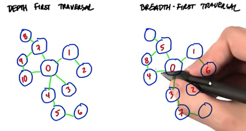

DFS算法需用的缓存会少一些，而BFS则有较高的并行度，但对中间存储要求高一些。

对于BFS来说，我们比较关心的是从root结点来使，遍历整个图的深度。对于n个结点的图来说，最大可能的深度为n-1（串连的形状），则小可能的深度为1（一个星状发散的形状）。

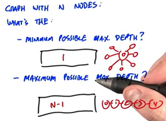

显示当图最有最小深度时，这个图的结构是最合适并行化遍历的。

接下来我们研究如何设计一个好的并行化算法来执行BFS。我们希望这个算法具有以下的特性：

* 并行度高
* 合并内存访问
* 最小化线程发散
* 容易实现

先来看第一种算法，这个算法的设计比较一般。它的思想，就是从一个入口点开始，一圈一圈的向外来设置每个顶点的度，每一圈就是一次迭代。

首先我们使用一个数组v[n]代表n个结点的深度，根节点的深度为0，初始状态下都为-1，我们可以用这个数组也样表示这个结点有没有被访问过。用一个pair来表示边，比如下面的图，我们可以表示为：

Vertices：0, 1, 2, 3, 4, 5, 6

Edges：（0,1), (1,2), (2,3), (3,4), (2,5), (5,6)

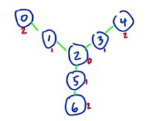

那我们遍历的算法可以描述为以下：

* 对整个图进行多次迭代，迭代次数，取决于图的最大深度
* 每轮迭代，遍历所有的边，检查这条边的两个顶点的深度值v[first]和v[second]，如果有一个不为-1，另一个为-1，则将为-1的那个顶点的度设置为不为-1顶点的深度+1。
* 某轮迭代，所有的点的深度都不变化时，迭代结束。

初始化每个顶点的度，入口顶点初始化为0。


bfs的kernel函数，并行的处理每条边，然后看左右结点的度的情况。

需要注意的是，这里可能会存在多个线程同时修改vertices的情况，按道理这里要加锁的，不知道代码里，为什么不加，课程中描述的是，可以忽略，因为重复赋值是没有关系的，因为多个线程只会赋值相同的值。

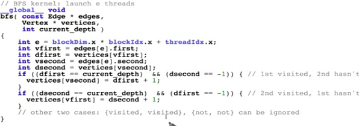

结束迭代的代码逻辑，kernel代码中，如果有顶点的深度被修改了，就是把done设置为false，每一轮迭代kernel执行完，就会把done从device拷贝到host上。然后在再一轮迭代开始前，先设置为true。

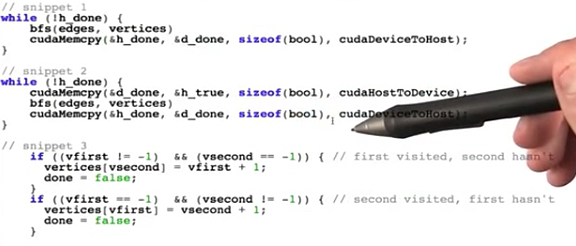

这个算法的并行度、内存访问、线程发散情况都不错，但是算法复杂度是O(VE)，复杂度较高。

这个算法显然有很多冗余的地方，对于边的访问，尤其是到了后面的迭代轮次，大部分边连接的顶点都已经被设置过有效的度了，但每一轮迭代都需要处理一遍。

**另外一种算法**：

该算法是由Duane Merill和他的同事发表于2012年。[Duane Merill](https://github.com/dumerrill)应该是cub库的核心贡献者。

如果我们能够有效识别出来，哪些是已经访问过的结点（设置为度），哪些是未访问的圈外结点，就好了。

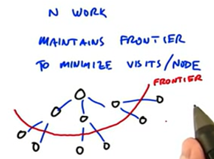

首先新的算法，将换一种图结构的表示算法，有些类似于稀疏矩阵CSR表示方法：


其中的C数组，按顺保存每个结点的邻居的编号，比如1号结点的邻居是(0, 2, 4)，C的长度就是边的个数

而R数组长度是结点个数+1，它表示的是每个结点的邻居在C数组中的开始位置。可以看出第i个结点的邻居在C中就是[R[i], R[i+1])区间内。像2号结点，它没有邻居，它的邻居在C中的范围是[5,5)，是个空集合。

D数组表示的是每个顶点的度，它的长度就是顶点的个数，初始化为-1，入口点的度初始化为0。

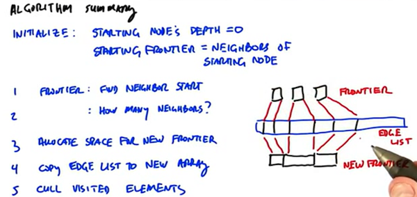

这个算法的运行步骤如下：

初始化：初始点的深度为0，初始化Fronter（前沿点）为初始化的邻居点。

1. 并行计算每个Fronter中的点v的邻居个数，即R[v+1] - R[v]
2. 为新的Fronter申请空间
3. 执行稀疏并发复制。
4. 在新的数组上执行并发访问，修改D数组，类似于前面一种算法。

比如对于算法的第一轮，Fronter为[1,3]，对应的邻居个数是R[2]-R[1]=3，R[4]-R[3]=1，所以一共需要新申请4个空间。然后使用SCAN来计算稀疏拷贝在新数组中的起点位置，即[0, 3]。分别将C[R[1]]开始的3条数据拷贝到新数组下标0开始的空间上，将C[R[3]]开始的1个数据拷贝到新数组下标3开始的空间上。

### List Ranking


对于一个链表来说，每个结点都有一个指针指向了其后继结点。现在我们的需求是，从每个结点开始，要访问到链表的最后一个元素。

我们为每个结点增加一个指针为Chum，通过循环，每次将Chum向前移动，那最终都会移动到最后一个结点。

那么平均要循环n次，才能让最左边的结点的chum指针指向最后一个结点。

我们有更快的方法吗？

由Danny Hillis和Guy Steele在1986年提出了新算法（新算法并不是由他们发现，他们只是做了很好的描述）。

每轮迭代，本身我们只能向前前进一格，但通过指针的指针，我们可以向前前进很多。

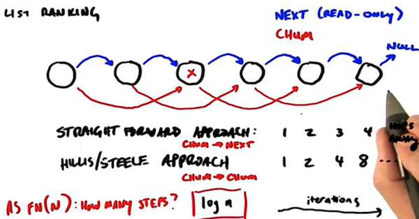


正式引入List Ranking问题：

输入：每一个结点和其后续结点，并指定一个起始结点

输出：按顺输出每个结点

这个算法用CPU实现非常容易，从每一个结点开始，依次查找下去就可以了，复杂度是O(n)

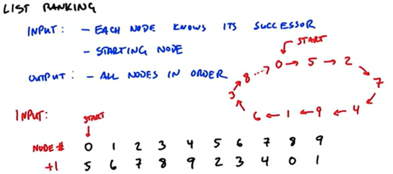

下面我们介绍在GPU上并行度较高的算法，它的算法复杂度是O(logn)，但它实际的Work是比CPU多的，但Step比CPU少。

这个算法分为2个阶段：

第一个阶段通过迭代来查询离每个结点一定hops的结点，每轮迭代，分别查找的是1,2,4,8这样的hops的结点。

第二个阶段需要计算出每个结点的在最终序列中的输出位置，也是需要logN次迭代，每次迭代会激活一部分结点（输出该部分结点的最终位置）

首先被激活的是Start结点，它输出在0号位置

0， -1， -1， -1， -1， -1， -1， -1， -1， -1

第一次迭代，按1hops来查找已经激活结点的后续，然后将其激活

0， -1， -1， -1， -1，  1， -1， -1， -1， -1

第二次迭代，按2hops来查找已经激活结点的后续，然后将其激活，被激活点的outpos为激活结点的outpos+2(hops)

0，-1， 2， -1， -1， 1， -1，  3， -1， -1

后续类推，4hops的

0，6， 2， -1， 4， 1， 7，  3， -1， 5

8hops的：

0，6， 2， 8， 4， 1， 7，  3， 9， 5


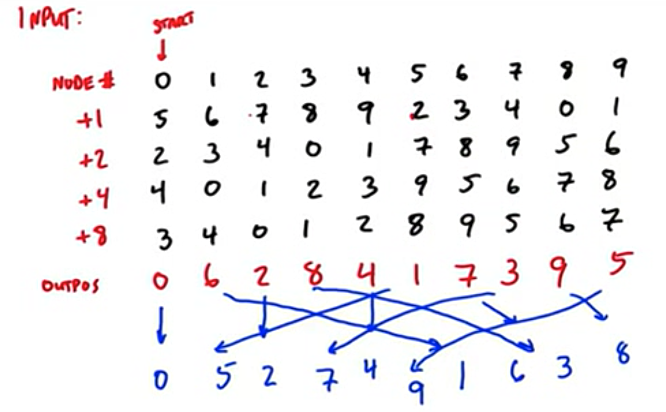

### 并行算法在HashTable上的应用

在一般的HashTable中，假设每个桶中是通过链表或红黑树来解决冲突问题。

对于GPU并发的查找问题，由于每个线程查询的Key不一样，所以它们有的可能很快就查询到返回了，有的访问到一些特别大的桶中，返回很慢，容易出来Wrap发散问题。

而对于插入的话，更是需要解决数据冲突的问题，比如多个线程同时往HashTable中插入同样的Key。

结论就是，通过链表方法来解决冲突的HashTable对于GPU并发非常不友好。

这里提出的是布谷鸟（CucKoo）哈希算法，布谷鸟会把自己的蛋生在别的鸟窝中。

新算法的哈希表是有多个哈希表（每个哈希表一个HashFunction）组成，对于N个元素要往哈希表中添加，按顺序插入某一张表中，没有冲突，则插入到桶中，如果有冲突，则将原来桶中的元素挤出来，原来的元素，则向后一张哈希表中找位置，如果有冲突，则再把别人挤掉，直到最终都找到位置。

它的好处就是在GPU可以对多个哈希表同时计算HashFunction并进行查找。

## Lesson 7  Additional Parallel Computing Topics

### Parallel Optimization Pattern

7种并发编程模式：[Optimization and architecture effects on GPU](./papers/Optimization_and_architecture_effects_on_GPU_compu.pdf)

#### Data layout transformation

它的核心是重新整理数据的布局，以获取更好的内存性能。有一个叫Burst utilization的指标可以来衡量。

这里举的例子是AoS（Array of Structure）-> SoA （Structure of Array）

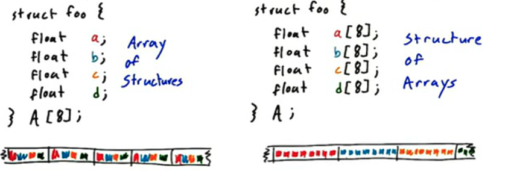

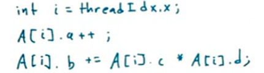

对于像上面这样的代码，SoA会更具有性能优势。

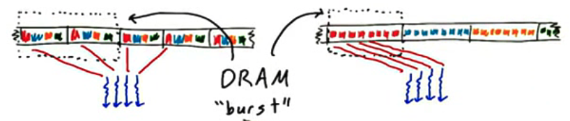

#### Scatter-to-Gather transformation

Scatter和Gather的区分：在Scatter中，线程是分别给输入数据的，每个线程再决定输出到某个输出位置上。而Gather，线程是分配给输出数据的，每个线程可能会读取多个输入位置。

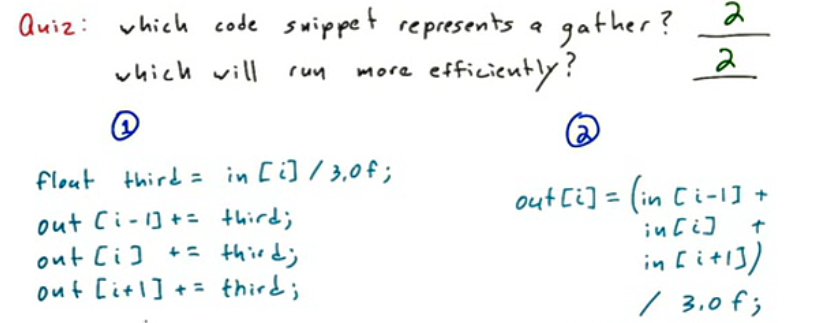

上面代码中Gather会更加高效，因为左边Scatter的代码，会涉及到要解决不同线程之间写冲突的问题。

Gather: 会有很多重叠的读取

Scatter: 可能会有很多冲突的写入

#### Tiling

在芯片的快速存储上（比如共享内存上）缓存那些会被重复读取的数据。比如我们对图片进行模糊，则我们一般会将图像分成一块一块的Tile，然后将这一块的数据加载到SharedMemory中，然后进行模糊处理。

#### Privatization

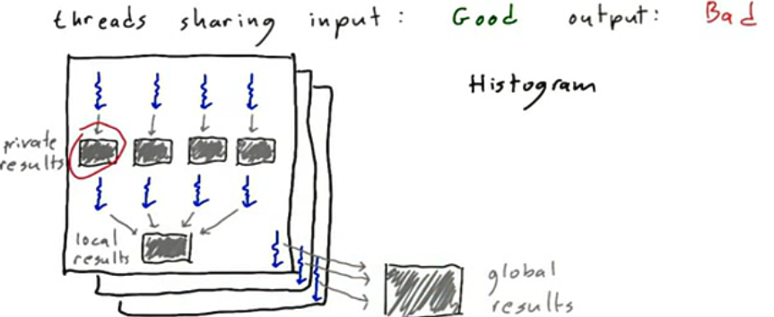

这个技术是指，当我们有多个线程都在写一些全局数据时，我们可以让每个线程独立拷贝一份全局数据进行私有化，这样就不会做一些线程间加锁与同步的事情。最后再用额外的线程来考虑每个线程上结果的合并。

这一技术在直方图的作业中可以使用。

#### Binning / Spatial Data Structures

Binning：Build Data structure that map output locations to the relevant input data

就是当我们不能明确我们对应位置的输入，需要哪些位置的输入时，我们可能需要把输入都遍历一遍，但这是巨大的计算浪费。所以Binning就是把input按一定的规则装到一个一个的Bin中，这个时候，我们计算输出时，只需要查看对应的一个或几个Bins就可以了。

举个例子，我们要计算每个城市可能的门店附近300Km城市的人口之和，一般做法，我们需要检查每个城市和该门店的距离，然后把小于300Km的留下进行统计计算。


使用Binning的方法，就是对整个地图划分300Km的网络。这样我们只需要在可能的网格中的检查对应的城市就可以了。

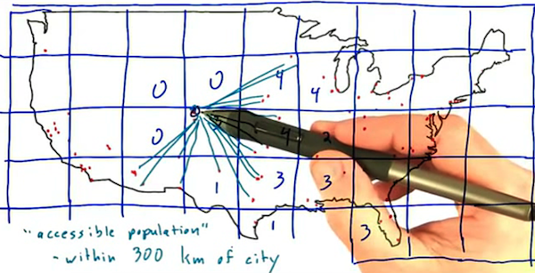

#### Compaction

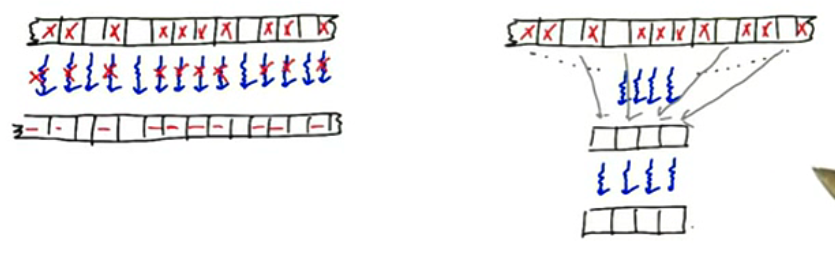

Compaction做的事情就是，处理的数据中，只有一部分满足计算的条件，那么就会导致wrap中有大量线程是闲置的。优化的方法，就是把那些满足条件的数据单独挑选出来，拷贝到一块新空间中，然后再用较小的线程来进行运算。

#### Regularization - load balancing

正则化是指重新组织数据来减少线程之间任务的不平衡性。

比如上面美国城市距离的例子，有一些网络里城市很少，而有一些网络中城市很多。

### Libraries

整个cuda编程或并行计算方面是个巨大的生态，在这个生态里，有NVDIA官方、第三方机构、商业组织、开源社区等都会有一些写好的，针对某一领域或通用的cuda库。

这里列举一些比较好的库，它们具有以下的特点：

1. 非常成熟稳定
1. 是经过一些优化专家设计的，具有很好的性能
1. 会随着新的GPU架构进行适配与优化的

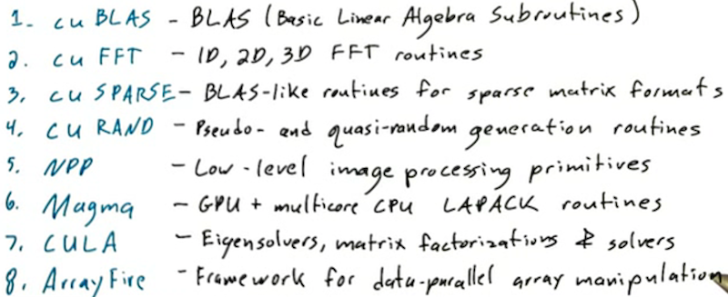

### Programming Power Tools

这类的库很少会针对某一具体的领域设计一些接口，而更多的是提供一些基础功能让程序员去实现自己的解决方案。我们把这一类的库称为Power Tools。

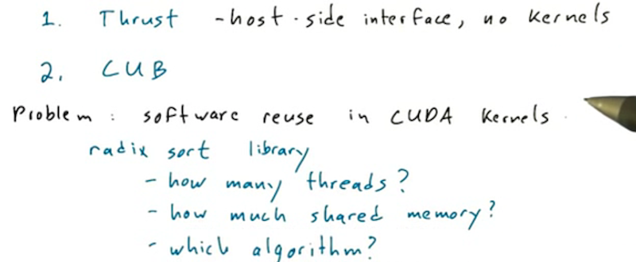

[**CUB**](https://github.com/NVIDIA/cub): CUDA unBind, CUB provides state-of-the-art, reusable software components for every layer of the CUDA programming model.

[**CudaDMA**](http://lightsighter.github.io/CudaDMA/) is a library of DMA objects that support efficient movement of data between off-chip global memory and on-chip shared memory in CUDA kernels. CudaDMA objects support many different data transfer patterns including sequential, strided, and indirect patterns.

### Platforms

CUDA不等价于CUDA C/C++，CUDA本身是和语言无关的架构，所以我们还可以使用一些别的语言进行CUDA编程，比如Python，Matlab、Fortran等。

跨平台并行编程的框架：OpenCL、OpenGL、OpenACC，前两者和CUDA很类似，会有一些并行编程的模型，比如线程块，SharedMemory等，而OpenACC更像是OpenMP属于一种前导式编译指示符，放在一些需要并行化的语句块的前面 。

## Dynamic Parallelism

动态并行意思就是可以让kernel函数内，再启动新的kernel函数。动态并行特别适配一些嵌套并行（Nested Parallelism）和一些递归并行（Recursive Parallelism）逻辑的算法。

上边是普通的从host来调用kernel函数Hello，而下边HelloWorld本身就是一个kernel函数，它的内部再次调用了kernel函数Hello。

```cpp
__global__ void Hello() {
	printf("Hello");
}
void main() {
	Hello<<<1, 1>>>();
  cudaDeviceSynchronize();
  printf("World");
}
```

```cpp
__global__ void Hello() {
	printf("Hello");
}
__global__ void HelloWorld() {
	Hello<<<1, 1>>>();
  cudaDeviceSynchronize();
  printf("World");
}
```

动态并行编程过程中需要注意的问题：

1. 每个线程执行相同的代码段，所以在kernel函数内部的kernel函数可能会被父级的多个线程同时启动，所以一般的编程中，可能需要指定哪个线程去启动子kernel函数。

   ```cpp
   __global__ void launcher() {
     if(threadIdx.x == 0) {
       kernel<<<1,1>>>();
     }
   }
   ```
   
2. 每个线程块执行时都是彼此独立的，线程块内部的Streams和Events都是私用的。

3. 线程块内的共享存储是私有的，不可以传递给子Kernel函数。

使用动态并行编写快排的示例：

```cpp
__global__ void quicksort(int  *data, int left, int right) {
  int nleft, nright;
  cudaStream_t s1, s2;
  partiition(data+left, data+right, data[left], nleft, nright);
  
  if(left < nright) {
    cudaStreamCreateWithFlags(&s1, cudaStreamNonBlocking);
    quicksort<<<..., s1>>>(data, left, nright);
  }
  if(nleft < right) {
    cudaStreamCreateWithFlags(&s2, cudaStreamNonBlocking);
    quicksort<<<..., s2>>>(data, nleft, right);
  }
}
```
