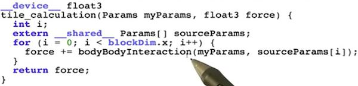

# Udacity 344 Intro to Parallel Programming

- 本课程除了教你在GPU上进行并行计算外，重要的是介绍并行计算的思维

## Lesson 1 GPU Programming Model

### CPU vs. GPU 架构

- 如何让处理器处理的更有效率：
  - 提高时钟频率，让单位时间执行的指令更多
  - 提高单条指令的能力，比如处理更多的数据，SIMD
  - 同时有多个执行单元，多核
- 选择2头牛还是选择1024只小鸡，在并行计算中，往往会选择1024只小鸡
- GPGPU: 图片处理单元（GPU）上的通用编程
- 这些年晶体管越来越小，已经达到了5nm以下，我们可以在同样尺寸上芯片上放更多的晶体管来达到更大的算力，但是为什么这些年CPU芯片的时钟频率没有怎么提高？首先是功耗，其次是散热。[为什么主流CPU的频率止步于4G?](https://zhuanlan.zhihu.com/p/30409360)
- CPU架构上花了很多晶体管在电力与逻辑控制上，所以计算的效率并非最优的，GPU是有优势的。
- 传统CPU优化的是单条指令的执行时间（latency，延时），而GPU优化的是吞吐量（throughput）。

### GPU编程

- GPU像是一个CPU的协处理器，GPU是自己的存储，我们一般称为显存。

- 程序的执行是由CPU发起的，在整个程序运行过程中，可以通过CPU调用GPU的能力，比如驱动GPU申请一块显存、驱动GPU完成显存往内存上的拷贝、 驱动GPU执行一个kernel函数等。

- GPU编程的经典步骤
  - 用cudaMalloc申请显存
  - 用cudaMemCpy把内存数据拷贝到显存上
  - 执行Kernel函数，并行的对这些数据执行计算
  - 将结果cudaMemCpy回内存上
  
- GPU上编程最核心的就是如何编程kernel函数，它的代码就像只在一个核上运行。

- GPU非常擅长做2件事情：1）同时启动大量的线程； 2）同时运行多个线程 。

- kernel函数调用的写法`kernel_function<<<dim3(bx,by,bz), dim3(tx,ty,tz),shmem>>>(args...)`。

- 其中dim3是一个数据结构，有`x`、`y`、`z` 3个成员。隐藏转换`num`为`dim3(num, 0, 0)`。

- `threadIdx`用于在kernel函数中获取当前线程在`block`中的定位，`blockIdx`用于获取当前`block`在`grid`中的定位。

- 在kernel函数中通过`blockDim`来获取一个`block`的维度，通过`gridDim`来获取`grid`的维度。

- 每个GPU都有一些编程限制，可以通过`deviceQuery`程序来查看：

  ```txt
  Total amount of global memory:                 6075 MBytes (6370295808 bytes)
  (10) Multiprocessors, (128) CUDA Cores/MP:     1280 CUDA Cores
  GPU Max Clock rate:                            1709 MHz (1.71 GHz)
  Memory Clock rate:                             4004 Mhz
  Memory Bus Width:                              192-bit
  L2 Cache Size:                                 1572864 bytes
  Total amount of constant memory:               65536 bytes
  Total amount of shared memory per block:       49152 bytes
  Total number of registers available per block: 65536
  Warp size:                                     32
  Maximum number of threads per multiprocessor:  2048
  Maximum number of threads per block:           1024
  Max dimension size of a thread block (x,y,z): (1024, 1024, 64)
  Max dimension size of a grid size    (x,y,z): (2147483647, 65535, 65535)
  Maximum memory pitch:                          2147483647 byte
  ```
  
- 如上图所示，每个block中最大有1024个线程，而每个sm中最大有2048个线程，所以每个sm最大同时执行2个block。

- 在我1060的卡上测试，如果blockDim设置为(1024, 2, 1)，使用`cudaGetLastError`获取错误返回为：`invalid configuration argument`。

##  Lesson 2 GPU Hardware and Parallel Communication Pattern

### 并计算中的通信模式

- Map: 每个对应的输出位置，访问其一一对应的输入位置
- Gather：每个输出位置，都会访问多个的输入位置
- Scatter：每个输入位置，都会对应被多个输出位置读取
- Stencil：每个输出位置，都访问输入中一个模板对应的位置
- Transpose：输入输出一一对应，但在2维结构上，是转置的


### GPU架构

-  我们通过kernel函数启动的大量GPU线程，是按块，划分为多组的。其中一个block里的所有线程，会调度到同一个流处理器（SM）上执行，每个SM上都有一个shared_memory，可以被这一组线程共享访问。
- 多个block被调度到不同的SM上，顺序是不能保证，执行时间也没有保证。
- 不同的kenrel函数之间执行是串行的，只当前的kenrel函数中的所有block都执行完后，下一个kernel函数才会执行。


- GPU的内存层次：每个线程都有自己的local memory，每个SM有shard memory，可以被一个block中的多个线程共享访问；所有SM中的线程都可以访问global memory。

- 同一个block中的线程经常需要共享操作shared_memory，比如先写再读，那就需要等所有线程都写完后，所有线程才能开始读。这时就需要所有线程同步，`__syncthreads()`就是一种`barrier`措施，在插入了`__syncthreads()`的地方，所有线程执行到这里时，都需要等待，当前所线程都到达时，才再次开始同时执行。

- 对于shared memory的使用，一般都是先写入，后用；可以用在那些一次载入，多次使用的数据上。如果访问模式中有错位（对应线程序号，访问了非对应位置的shared memory)，那都需要在读取后，设置`barrier`，然后读取。比如：

  ```c
  __shared__ int arr[128];
  // arr[i] = arr[i + 1];
  temp = arr[i + 1];
  __synthreads();
  arr[i] = temp;
  ```

### 编写高性CUDA程序

- 最大化计算密度，计算密度 = 计算 / 访存
- CUDA程序优化的核心往往都是优化访存的时间
- 对于Gobal Memory的访问，特别要注意，连续访问的性能，比按Stride的性能高，更比随机访问的性能要高。（这里应该是因为有L2 Cache的原因）
- 多线程访问同一个global memory资源时，需要加锁； 或使用原子函数：`atomicAdd`等。
- 避免线程发散（不同的线程，走了不同的if-else分支，或循环次数不同）。

## Lesson 3 Fundamental GPU Algorithms: Reduce、SCAN、Histogram

- GPU算法中，往往通过度量`Step`和`work`来评估并行算法的复杂度
- Reduce算法的定义：
  - Set of Elements
  - Reduce Operator: 1）2元运算法； 2）具有结合性 (a op b) op c  = a op (b op c)
- Reduce算法的GPU实现：
  - 按线程块划分，每个线程块分别Reduce，然后把所有线程块的结果再Reduce一下。
  - 每个线程块内采用步长的循环，两两相加，结果写在前一个结果上。
  - Reduce在GPU实现的STEP复杂度为`O(logN)`，WORK复杂度为`O(N)`
- SCAN算法的定义
  - Set of Elements
  - Reduce Operator: 1）2元运算法； 2）具有结合性 (a op b) op c  = a op (b op c)
  - 存在单位元I，满足 a op I = a
- SCAN算法包括2种形式：1）Inclusive； 2）Exclusive
- Hillis Steele SCAN算法
- Blelloch SCAN算法
- Histogram算法

## Lesson 4 Fundamental GPU Algorithm: Application of Scan and Sort

- Compression

- Merge Sort
- Bitonic Sort
- Radix Sort

## Lesson 5 Optimizing GPU Programs

- 高效GPU程序的几个原则
  - 增大程序的计算密度
  - 减小程序的存储操作密度
  - 合并全局内存访问 
  - 避免线程发散
  - 利用好存储的层次结构
- 优化的层次，一般注重前3条就行了，在GPU下，后2条，尤其是最后一条的收益不大
  - 选择好的算法
  - 遵守GPU编程的基本原则（上面那几条）
  - 与架构相关的详细优化
  - 指令级别的微优化
- APOD流程
  - Analyze: 部析程序的热点部分，是不是可以并行化加速
  - Parallelize：使用AVX、OpenACC、OpenMP、CUDA等来加速
  - Optimize
  - Deploy：在真实的数据与环境上运行，看效果
- 矩阵转置的GPU实现
  - 直接GPU加速会，导致DRAM的带宽使用率低，因为会出来大Stride写入的问题
  - 每次Load一块，在shared memory中进行转置，再拷贝回去
  - 使用shard memory就会遇到 __syncthreads的问题，这时候，需要适当降低线程块中线程的数量
- 优化所有线程在`barrier`前面的等待时间
- 避免同一个`wrap`中所有线程的线程发散（有不同的执行分支），因为所有wrap中的线程是同步执行的，如果有分支，那当有一部线程在执行某个分支时，其他线程在等待。
- 使用一些内置的数学函数：`__sin`、`__cos`、`__exp()`等
- 使用`pinned memory`
- 使用MultiStream和异步拷贝。不同stream上内存操作与核函数执行都是可以异步的，同一个stream上的拷贝与核函数执行是排队的。

## Lesson 6 Parallel Computing Patterns

对于GPU编程来说，最大的挑战在于，对之前从来没有见过的问题或求解模式进行并行化。所以本节的主要内容，就是看一些有趣的问题，如何被并行化的。

### Dense N-Body

这个问题的背景与解决方法，可以参考NVIDIA的官方博客：[chapter-31-fast-n-body-simulation-cuda](https://developer.nvidia.com/gpugems/gpugems3/part-v-physics-simulation/chapter-31-fast-n-body-simulation-cuda)

All Pair N-Body是N-body中最简单的模式，也被称为蛮力方法，包括分开计算每对元素之间的力，然后对每个元素上产生的力进行加和。它的算法复杂度是$O(n^2)$。

对于Nbody问题，有很多可以加速的方法，用于近似计算，比如基于树的方法，有种算法叫Barnes Hut，它的算法复杂度是$O(n\log(n))$。

快速多极（Multi-pole）算法可以用于高精度的快速近似计算，复杂度为$O(n)$：它的本质是把遥远的物体混为一体，在计算过程中把它们视为一个单一的整体。快速多极算法实际上被评为20世纪10大算法之一。

multipole算法：[论文](https://aip.scitation.org/doi/pdf/10.1063/1.4773727)，[实现](https://github.com/duanebyer/nbody)

我们这里将通过演示All pair Nbody的计算问题来演示，如何有效地使用内存层次结构来加速我们的计算过程。

朴素来实现的话，我们都使用global memory，那么在我们计算$N\times N$的Nbody的关系矩阵时，每个元素都需要被我们反复多次的读入内存，如果我们是使用$N^2$的线程，每个线程计算一对pair之间的力，那每个元素会被从global memory中加载2N次，分别是该序列在$N\times N$矩阵中对应的那一行和那一列。


将整个矩阵划分为网格，每个网格我们称之为一个Tile，它的大小是$p\times p$，正常情况下，我们要计算这个网络内的矩阵值的话，我们需要把这个网格涉及到的元素从global memory加载，每个元素都要被加载$2p$次。

我们的优化目标是，对于一个Tile中需要加载的元素，我们只加载1次。

如果我们使用的方式是对于这个Tile中的$p^2$个点，使用$p^2$个线程，那会存在很多的问题：1）这些线程之间需要通过sharedMemory来共享数据；2）当我们进行力的横向加和时，需要考虑线程之间的同步问题。

另外一种方式是是只使用$p$个线程，每个线程在横向上计算，使用一个`for`循环。



这种模式下，只需要将sourceParams加载为sharedMemory中，而dstParams不需要共享了。也不需要在不同线程间来汇总单独的力。


这种模式降低了整个程序的并行度，但当我们解决的Nbody问题的N很大的时候，我们对线程的使用率是很高的，这种模式也能达到很高的计算吞吐。

选择多大的网格$p$，如果网格太大，会导致我们要加载进sharedMomory中的sourceParms较大，有可能sharedMemory放不下。同时如果网格太大，将会导致线程块较少，可能用不完所有的SM。

如果网格太小，那么对于global memory的访问压力就会比较大。


 这个例子说明了，在一些问题上，适当让每个线程做更多的事，减少并发程度，可能会取得更好的效果。

### 稀疏向量乘法实现优化SpMV


上面的代码计算的是$y += Mx$，其中$M$是稀疏矩阵，$x$和$y$都是列向量。

在cuda代码中，每个线程计算y的一行的结果。

由于M中每行的长度可能不一样，导致了一个线程束（wrapper）的执行时间，取决于运行最慢的那个线程。

这种情况下我们可以采用，每个线程只计算2个数乘法，然后用bacward inclusive SCAN SUM来计算每一行乘积的加和。这种算法对于每一行长度的变化就不敏感了。但这种算法需要线程间通信了。


针对这个问题，比较学术的讨论可以参考：[Efficient Sparse Matrix-Vector Multiplication on CUDA](http://wnbell.com/blog/2008/12/01/efficient-sparse-matrix-vector-multiplication-on-cuda/)


这个例子说明了2个优化思路：

* 需要让线程尽可能的busy，一个wapper里的线程不能太发散
* 管理通信开销同样重要

### 图的广度优先搜索

对于一个图来说，如果每个顶点相连接的边很多，则这个图是一个稠密的图，相反，如果边很少，则是一个稀疏的图。

现实中的很多问题都可以用图模型来建模，比如整个Web可以看成一个超大的图，页面就是顶点，而页面之间的超连接关系构成了边；人的社交关系就是一个很大的图，顶点就是每个人，边则是两个人认识，互为好友关系。

对于图结构，最广泛的操作就是对图中所有的结点的遍历，比如对于Web，我们的爬虫程序实现就是在执行对于整个Web图网络的遍历。对于图的遍历一般有2种方法，深度优先（DFS：Depth First）和广义优先（BFS：Breadth Frist）。


DFS算法需用的缓存会少一些，而BFS则有较高的并行度，但对中间存储要求高一些。

对于BFS来说，我们比较关心的是从root结点来使，遍历整个图的深度。对于n个结点的图来说，最大可能的深度为n-1（串连的形状），则小可能的深度为1（一个星状发散的形状）。


显示当图最有最小深度时，这个图的结构是最合适并行化遍历的。

接下来我们研究如何设计一个好的并行化算法来执行BFS。我们希望这个算法具有以下的特性：

* 并行度高
* 合并内存访问
* 最小化线程发散
* 容易实现

先来看第一种算法，这个算法的设计比较一般。

首先我们使用一个数组v[n]代表n个结点的深度，根节点的深度为0，初始状态下都为-1，我们可以用这个数组也样表示这个结点有没有被访问过。用一个pair来表示边，比如下面的图，我们可以表示为：

Vertices：0, 1, 2, 3, 4, 5, 6

Edges：（0,1), (1,2), (2,3), (3,4), (2,5), (5,6)


那我们遍历的算法可以描述为以下：

* 对整个图进行多次迭代，迭代次数，取决于图的最大深度
* 每轮迭代，遍历所有的边，检查这条边的两个顶点的深度值v[first]和v[second]，如果有一个不为-1，另一个为-1，则将不为-1的那个顶点的度设置为不为-1顶点的深度+1。
* 某轮迭代，所有的点的深度都不变化时，迭代结束。

初始化每个顶点的度，入口顶点初始化为0。


bfs的kernel函数，并行的处理每条边，然后看左右结点的度的情况。

需要注意的是，这里可能会存在多个线程同时修改vertices的情况，按道理这里要加锁的，不知道代码里，为什么不加，课程中描述的是，可以忽略，因为重复赋值是没有关系的，因为多个线程只会赋值相同的值。


结束迭代的代码逻辑，kernel代码中，如果有顶点的深度被修改了，就是把done设置为false，每一轮迭代kernel执行完，就会把done从device拷贝到host上。然后在再一轮迭代开始前，先设置为true。


这个算法的并行度、内存访问、线程发散情况都不错，但是算法复杂度是O(VE)，复杂度较高。

**另外一种算法**：

